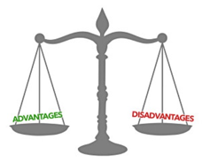
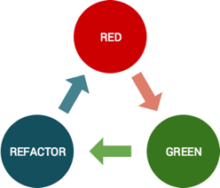

## Test Driven Development
---

### TDD란?
소프트웨어가 개발되기 전에 테스트 케이스로 변환되는 소프트웨어 요구 사항에 의존하고
모든 테스트 케이스에 대해 소프트웨어를 반복적으로 테스트하여
모든 소프트웨어 개발을 추적하는 소프트웨어 개발 프로세스.

**소프트웨어가 먼저 개발되고 테스트 케이스가 나중에 생성되는 것과 반대**

### TDD의 이점
1. **코드의 유지보수가 용이**
프로그래밍 개발에서는 처음 개발할 때보다 이미 개발한 코드의 버그를 수정하고, 최적화하고, 새 기능을 추가할 때 비용이 
더 들어간다. 테스트를 작성하면 코드에 절대로 뒤떨어지지 않는 문서가 탄생하며, 다른 코드의 행위가 보증되므로 원하는
부분에만 신경을 쓸 수 있으며, 테스트하기 쉬운 코드는 자연히 품질이 높아지므로 다시 읽기도 편하다. 
또한 테스트가 있으면 안심하고 코드를 리팩토링할 수 있다.

2. **프로그래밍 시간이 단축**
테스트를 작성하는 시간을 포함시키고도 오히려 전체 작업 시간은 줄어든다. 프로그래밍에서 대부분의 시간이 디버깅에 
투입되는데, 테스팅은 디버깅을 해야 할 범위를 단위 안으로 제한함으로써 디버깅에 들어가는 노고를 크게 줄여준다. 
또한 유지보수 시에도 상술한 이유로 효율이 높아진다.

3. **프로그램 소스코드 기록**
테스트를 작성하는 것 자체가 훌륭한 소스 코드의 기록이다. 소스 코드 중간중간의 주석은 왜 코드가 이렇게 짜여져 
있는지를 기록한다면, 유닛 테스트는 코드가 어떻게 행동해야 하는지를 기록한다. 따라서 코드를 파악하고 프로그램을 
수정, 확장하는데 시간과 비용이 크게 단축된다.

### TDD의 단점

1. **생산성 저하**
코드를 두번 작성해야 하기 때문에 생산성이 저하된다. *(장기적으로는 개발 비용 절감)*

2. **기존 개발 방식 변화**
습관을 고치는 것은 많은 노력이 필요하고 매우 어려운 일이다.

### 방법 및 순서
1. 실패하는 작은 단위 테스트를 작성
2. 테스트를 통과하기 위해 프로덕션 코드를 작성
3. 그 다음의 테스트 코드를 작성
4. 실패 테스트가 없을 경우에만 성공 테스트를 작성
5. 새로운 테스트를 통과하기 위해 프로덕션 코드를 추가 또는 수정
6. 상기 단계를 반복하여 실패/성공의 모든 테스트 케이스를 작성
7. 개발된 코드들에 대해 모든 중복을 제거하며 리팩토링

### 접근 방법
1. **가짜로 구현하기**
실패하는 테스트를 가장 빠르게 구현하는 방법은 아무 값이나 반환하도록 하는 것이다.
그리고 테스트가 통과하면 단계적으로 상수를 변수를 사용하도록 변형한다.
*2 x 4를 구하는 테스트에서 반환값을 8이라는 상수로 고정시키고 단계적으로 상수를 변수를 사용하도록 변형*

2. **삼각측량법**
테스트 주도로 추상화된 과정을 일반화하는 과정
테스트 케이스가 두개 이상일때 사용
다른 input을 통해 일반화

3. **명백하게 구현하기**
가짜 구현이나 삼각 측량 방법을 사용하지 않고 바로 정답을 구현하는 방법이다.
현재 사용하는 곱하기와 같은 문제는 쉬우므로 다음과 같이 바로 진짜 구현을 해도 괜찮다

### TDD 방법론으로 개발하기 좋은 상황
- 처음해보는 프로그램 주제
- 고객의 요구조건이 바뀔 수 있는 프로젝트
- 개발하는 중에 코드를 많이 바꿔야 된다고 생각하는 경우
- 내가 개발하고 나서 이 코드를 누가 유지보수할지 모르는 경우

#### My Comment
최근 스타트업으로 이직하면서 여러가지 개발론을 배우고 적용시켜보고 싶었다.
그 중 회의적인 견해도 존재하지만 개발 능력을 향상시킬 수 있다는 것에는 반론이 없는 TDD에 관심이 생겨 관련 자료를 조사했다.
사내 개발 문화 전체를 변화시키진 못하더라도 내가 하는 개발에서 TDD를 적용시켜보고 그 장점을 보임으로써 서로에게 영감을 주는 개발 조직 전체의 스킬 향상이
일상이 되었으면 한다.

출처: http://clipsoft.co.k/wp/blog/tddtest-driven-development-%EB%B0%A9%EB%B2%95%EB%A1%A0/, https://ko.wikipedia.org/wiki/%ED%85%8C%EC%8A%A4%ED%8A%B8_%EC%A3%BC%EB%8F%84_%EA%B0%9C%EB%B0%9C, https://namu.wiki/w/%ED%85%8C%EC%8A%A4%ED%8A%B8%20%EC%A3%BC%EB%8F%84%20%EA%B0%9C%EB%B0%9C, https://mangkyu.tistory.com/182, https://toneyparky.tistory.com/3

